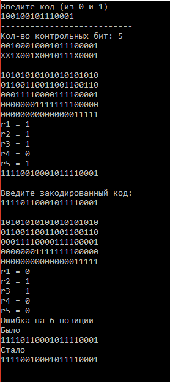

# Код Хэмминга
<h1>Содержание</h1>
  <ul>
    <li><a href="#about">Самокорректирующийся код</a></li>
    <li><a href="#code">Алгоритм кодирования</a></li>
    <li><a href="#decode">Самокорректирующийся код</a></li>
    <li><a href="#result">Результат работы программы</a></li>
    <li><a href="#experience">Полученный мною опыт</a></li>
  </ul>
<h2 id="about">Самокорректирующийся код</h2>

  <b>Код Хэ́мминга</b> — наиболее известный из первых самоконтролирующихся и самокорректирующихся кодов. Построен применительно к двоичной системе счисления. Позволяет исправлять одиночную ошибку (ошибка в одном бите) и находить двойную.

<h2 id="code">Алгоритм кодирования</h2>

  Предположим, что нужно сгенерировать код Хемминга для некоторого информационного кодового слова. В качестве примера возьмём 15-битовое кодовое слово <b>x1…x15</b>, хотя алгоритм пригоден для кодовых слов любой длины. В приведённой ниже таблице в первой строке даны номера позиций в кодовом слове, во второй — условное обозначение битов, в третьей — значения битов.

<table>
    <tr>
        <td>1</td>
        <td>2</td>
        <td>3</td>
        <td>4</td>
        <td>5</td>
        <td>6</td>
        <td>7</td>
        <td>8</td>
        <td>9</td>
        <td>10</td>
        <td>11</td>
        <td>12</td>
        <td>13</td>
        <td>14</td>
        <td>15</td>
    </tr>
    <tr>
        <td>x1</td>
        <td>x2</td>
        <td>x3</td>
        <td>x4</td>
        <td>x5</td>
        <td>x6</td>
        <td>x7</td>
        <td>x8</td>
        <td>x9</td>
        <td>x10</td>
        <td>x11</td>
        <td>x12</td>
        <td>x13</td>
        <td>x14</td>
        <td>x15</td>
    </tr>
    <tr>
        <td>1</td>
        <td>0</td>
        <td>0</td>
        <td>1</td>
        <td>0</td>
        <td>0</td>
        <td>1</td>
        <td>0</td>
        <td>1</td>
        <td>1</td>
        <td>1</td>
        <td>0</td>
        <td>0</td>
        <td>0</td>
        <td>1</td>
    </tr>
</table>

  Вставим в информационное слово контрольные биты r0…r4 таким образом, чтобы номера их позиций представляли собой целые степени двойки: 1, 2, 4, 8, 16… Получим 20-разрядное слово с 15 информационными и 5 контрольными битами. Первоначально контрольные биты устанавливаем равными нулю. На рисунке контрольные биты выделены розовым цветом.

<table>
    <tr>
        <td>1</td>
        <td>2</td>
        <td>3</td>
        <td>4</td>
        <td>5</td>
        <td>6</td>
        <td>7</td>
        <td>8</td>
        <td>9</td>
        <td>10</td>
        <td>11</td>
        <td>12</td>
        <td>13</td>
        <td>14</td>
        <td>15</td>
        <td>16</td>
        <td>17</td>
        <td>18</td>
        <td>19</td>
        <td>20</td>
    </tr>
    <tr>
        <td><b><ins>r0</ins></b></td>
        <td><b><ins>r1</ins></b></td>
        <td>x1</td>
        <td><b><ins>r2</ins></b></td>
        <td>x2</td>
        <td>x3</td>
        <td>x4</td>
        <td><b><ins>r3</ins></b></td>
        <td>x5</td>
        <td>x6</td>
        <td>x7</td>
        <td>x8</td>
        <td>x9</td>
        <td>x10</td>
        <td>x11</td>
        <td><b><ins>r4</ins></b></td>
        <td>x12</td>
        <td>x13</td>
        <td>x14</td>
        <td>x15</td>
    </tr>
    <tr>
        <td>0</td>
        <td>0</td>
        <td>1</td>
        <td>0</td>
        <td>0</td>
        <td>0</td>
        <td>1</td>
        <td>0</td>
        <td>0</td>
        <td>0</td>
        <td>1</td>
        <td>0</td>
        <td>1</td>
        <td>1</td>
        <td>1</td>
        <td>0</td>
        <td>0</td>
        <td>0</td>
        <td>0</td>
        <td>1</td>
    </tr>
</table>

  В общем случае количество контрольных бит в кодовом слове равно двоичному логарифму числа, на единицу большего, чем количество бит кодового слова (включая контрольные биты); логарифм округляется в большую сторону. Например, информационное слово длиной 1 бит требует двух контрольных разрядов, 2-, 3- или 4-битовое информационное слово — трёх, 5…11-битовое — четырёх, 12…26-битовое — пяти и т. д.

  Добавим к таблице 5 строк (по количеству контрольных битов), в которые поместим матрицу преобразования. Каждая строка будет соответствовать одному контрольному биту (нулевой контрольный бит — верхняя строка, четвёртый — нижняя), каждый столбец — одному биту кодируемого слова. В каждом столбце матрицы преобразования поместим двоичный номер этого столбца, причём порядок следования битов будет обратный — младший бит расположим в верхней строке, старший — в нижней. Например, в третьем столбце матрицы будут стоять числа 11000, что соответствует двоичной записи числа три: 00011.

<table>
    <tr>
        <td>1</td>
        <td>2</td>
        <td>3</td>
        <td>4</td>
        <td>5</td>
        <td>6</td>
        <td>7</td>
        <td>8</td>
        <td>9</td>
        <td>10</td>
        <td>11</td>
        <td>12</td>
        <td>13</td>
        <td>14</td>
        <td>15</td>
        <td>16</td>
        <td>17</td>
        <td>18</td>
        <td>19</td>
        <td>20</td>
    </tr>
    <tr>
        <td><b><ins>r0</ins></b></td>
        <td><b><ins>r1</ins></b></td>
        <td>x1</td>
        <td><b><ins>r2</ins></b></td>
        <td>x2</td>
        <td>x3</td>
        <td>x4</td>
        <td><b><ins>r3</ins></b></td>
        <td>x5</td>
        <td>x6</td>
        <td>x7</td>
        <td>x8</td>
        <td>x9</td>
        <td>x10</td>
        <td>x11</td>
        <td><b><ins>r4</ins></b></td>
        <td>x12</td>
        <td>x13</td>
        <td>x14</td>
        <td>x15</td>
    </tr>
    <tr>
        <td>0</td>
        <td>0</td>
        <td>1</td>
        <td>0</td>
        <td>0</td>
        <td>0</td>
        <td>1</td>
        <td>0</td>
        <td>0</td>
        <td>0</td>
        <td>1</td>
        <td>0</td>
        <td>1</td>
        <td>1</td>
        <td>1</td>
        <td>0</td>
        <td>0</td>
        <td>0</td>
        <td>0</td>
        <td>1</td>
    </tr>
    <tr>
        <td>1</td>
        <td>0</td>
        <td>1</td>
        <td>0</td>
        <td>1</td>
        <td>0</td>
        <td>1</td>
        <td>0</td>
        <td>1</td>
        <td>0</td>
        <td>1</td>
        <td>0</td>
        <td>1</td>
        <td>0</td>
        <td>1</td>
        <td>0</td>
        <td>1</td>
        <td>0</td>
        <td>1</td>
        <td>0</td>
        <td><b><ins>r0</ins></b></td>
        <td></td>
    </tr>
    <tr>
        <td>0</td>
        <td>1</td>
        <td>1</td>
        <td>0</td>
        <td>0</td>
        <td>1</td>
        <td>1</td>
        <td>0</td>
        <td>0</td>
        <td>1</td>
        <td>1</td>
        <td>0</td>
        <td>0</td>
        <td>1</td>
        <td>1</td>
        <td>0</td>
        <td>0</td>
        <td>1</td>
        <td>1</td>
        <td>0</td>
        <td><b><ins>r1</ins></b></td>
        <td></td>
    </tr>
    <tr>
        <td>0</td>
        <td>0</td>
        <td>0</td>
        <td>1</td>
        <td>1</td>
        <td>1</td>
        <td>1</td>
        <td>0</td>
        <td>0</td>
        <td>0</td>
        <td>0</td>
        <td>1</td>
        <td>1</td>
        <td>1</td>
        <td>1</td>
        <td>0</td>
        <td>0</td>
        <td>0</td>
        <td>0</td>
        <td>1</td>
        <td><b><ins>r2</ins></b></td>
        <td></td>
    </tr>
    <tr>
        <td>0</td>
        <td>0</td>
        <td>0</td>
        <td>0</td>
        <td>0</td>
        <td>0</td>
        <td>0</td>
        <td>1</td>
        <td>1</td>
        <td>1</td>
        <td>1</td>
        <td>1</td>
        <td>1</td>
        <td>1</td>
        <td>1</td>
        <td>0</td>
        <td>0</td>
        <td>0</td>
        <td>0</td>
        <td>0</td>
        <td><b><ins>r3</ins></b></td>
        <td></td>
    </tr>
    <tr>
        <td>0</td>
        <td>0</td>
        <td>0</td>
        <td>0</td>
        <td>0</td>
        <td>0</td>
        <td>0</td>
        <td>0</td>
        <td>0</td>
        <td>0</td>
        <td>0</td>
        <td>0</td>
        <td>0</td>
        <td>0</td>
        <td>0</td>
        <td>1</td>
        <td>1</td>
        <td>1</td>
        <td>1</td>
        <td>1</td>
        <td><b><ins>r4</ins></b></td>
        <td></td>
    </tr>
</table>

  В правой части таблицы мы оставили пустым один столбец, в который поместим результаты вычислений контрольных битов. Вычисление контрольных битов производим следующим образом. Берём одну из строк матрицы преобразования (например, r0) и находим её скалярное произведение с кодовым словом, то есть перемножаем соответствующие биты обеих строк и находим сумму произведений. Если сумма получилась больше единицы, находим остаток от его деления на 2. Иными словами, мы подсчитываем сколько раз в кодовом слове и соответствующей строке матрицы в одинаковых позициях стоят единицы и берём это число по модулю 2.

  Если описывать этот процесс в терминах матричной алгебры, то операция представляет собой перемножение матрицы преобразования на матрицу-столбец кодового слова, в результате чего получается матрица-столбец контрольных разрядов, которые нужно взять по модулю 2.

  Например, для строки r0:

  r0 = (1·0+0·0+1·1+0·0+1·0+0·0+1·1+0·0+1·0+0·0+1·1+0·0+1·1+0·1+1·1+0·0+1·0+0·0+1·0+0·1) mod 2 = 5 mod 2 = 1.

  Полученные контрольные биты вставляем в кодовое слово вместо стоявших там ранее нулей. По аналогии находим проверочные биты в остальных строках. Кодирование по Хэммингу завершено. Полученное кодовое слово — 11110010001011110001.

<table>
    <tr>
        <td>1</td>
        <td>2</td>
        <td>3</td>
        <td>4</td>
        <td>5</td>
        <td>6</td>
        <td>7</td>
        <td>8</td>
        <td>9</td>
        <td>10</td>
        <td>11</td>
        <td>12</td>
        <td>13</td>
        <td>14</td>
        <td>15</td>
        <td>16</td>
        <td>17</td>
        <td>18</td>
        <td>19</td>
        <td>20</td>
    </tr>
    <tr>
        <td><b><ins>r0</ins></b></td>
        <td><b><ins>r1</ins></b></td>
        <td>x1</td>
        <td><b><ins>r2</ins></b></td>
        <td>x2</td>
        <td>x3</td>
        <td>x4</td>
        <td><b><ins>r3</ins></b></td>
        <td>x5</td>
        <td>x6</td>
        <td>x7</td>
        <td>x8</td>
        <td>x9</td>
        <td>x10</td>
        <td>x11</td>
        <td><b><ins>r4</ins></b></td>
        <td>x12</td>
        <td>x13</td>
        <td>x14</td>
        <td>x15</td>
    </tr>
    <tr>
        <td>0</td>
        <td>0</td>
        <td>1</td>
        <td>0</td>
        <td>0</td>
        <td>0</td>
        <td>1</td>
        <td>0</td>
        <td>0</td>
        <td>0</td>
        <td>1</td>
        <td>0</td>
        <td>1</td>
        <td>1</td>
        <td>1</td>
        <td>0</td>
        <td>0</td>
        <td>0</td>
        <td>0</td>
        <td>1</td>
    </tr>
    <tr>
        <td>1</td>
        <td>0</td>
        <td>1</td>
        <td>0</td>
        <td>1</td>
        <td>0</td>
        <td>1</td>
        <td>0</td>
        <td>1</td>
        <td>0</td>
        <td>1</td>
        <td>0</td>
        <td>1</td>
        <td>0</td>
        <td>1</td>
        <td>0</td>
        <td>1</td>
        <td>0</td>
        <td>1</td>
        <td>0</td>
        <td><b><ins>r0</ins></b></td>
        <td>1</td>
    </tr>
    <tr>
        <td>0</td>
        <td>1</td>
        <td>1</td>
        <td>0</td>
        <td>0</td>
        <td>1</td>
        <td>1</td>
        <td>0</td>
        <td>0</td>
        <td>1</td>
        <td>1</td>
        <td>0</td>
        <td>0</td>
        <td>1</td>
        <td>1</td>
        <td>0</td>
        <td>0</td>
        <td>1</td>
        <td>1</td>
        <td>0</td>
        <td><b><ins>r1</ins></b></td>
        <td>1</td>
    </tr>
    <tr>
        <td>0</td>
        <td>0</td>
        <td>0</td>
        <td>1</td>
        <td>1</td>
        <td>1</td>
        <td>1</td>
        <td>0</td>
        <td>0</td>
        <td>0</td>
        <td>0</td>
        <td>1</td>
        <td>1</td>
        <td>1</td>
        <td>1</td>
        <td>0</td>
        <td>0</td>
        <td>0</td>
        <td>0</td>
        <td>1</td>
        <td><b><ins>r2</ins></b></td>
        <td>1</td>
    </tr>
    <tr>
        <td>0</td>
        <td>0</td>
        <td>0</td>
        <td>0</td>
        <td>0</td>
        <td>0</td>
        <td>0</td>
        <td>1</td>
        <td>1</td>
        <td>1</td>
        <td>1</td>
        <td>1</td>
        <td>1</td>
        <td>1</td>
        <td>1</td>
        <td>0</td>
        <td>0</td>
        <td>0</td>
        <td>0</td>
        <td>0</td>
        <td><b><ins>r3</ins></b></td>
        <td>0</td>
    </tr>
    <tr>
        <td>0</td>
        <td>0</td>
        <td>0</td>
        <td>0</td>
        <td>0</td>
        <td>0</td>
        <td>0</td>
        <td>0</td>
        <td>0</td>
        <td>0</td>
        <td>0</td>
        <td>0</td>
        <td>0</td>
        <td>0</td>
        <td>0</td>
        <td>1</td>
        <td>1</td>
        <td>1</td>
        <td>1</td>
        <td>1</td>
        <td><b><ins>r4</ins></b></td>
        <td>1</td>
    </tr>
</table>
<h2 id="decode">Алгоритм декодирования</h2>

  Алгоритм декодирования по Хэммингу абсолютно идентичен алгоритму кодирования. Матрица преобразования соответствующей размерности умножается на матрицу-столбец кодового слова и каждый элемент полученной матрицы-столбца берётся по модулю 2. Полученная матрица-столбец получила название «матрица синдромов». Легко проверить, что кодовое слово, сформированное в соответствии с алгоритмом, описанным в предыдущем разделе, всегда даёт нулевую матрицу синдромов.

  Матрица синдромов становится ненулевой, если в результате ошибки (например, при передаче слова по линии связи с шумами) один из битов исходного слова изменил своё значение. Предположим для примера, что в кодовом слове, полученном в предыдущем разделе, шестой бит изменил своё значение с нуля на единицу (на рисунке обозначено красным цветом). Тогда получим следующую матрицу синдромов.

<table>
  <tr>
    <th>1</th>
    <th>2</th>
    <th>3</th>
    <th>4</th>
    <th>5</th>
    <th>6</th>
    <th>7</th>
    <th>8</th>
    <th>9</th>
    <th>10</th>
    <th>11</th>
    <th>12</th>
    <th>13</th>
    <th>14</th>
    <th>15</th>
    <th>16</th>
    <th>17</th>
    <th>18</th>
    <th>19</th>
    <th>20</th>
  </tr>
  <tr>
    <th><b>r</b>0</th>
    <th><b>r</b>1</th>
    <th><b>x</b>1</th>
    <th><b>r</b>2</th>
    <th><b>x</b>2</th>
    <th><b>x</b>3</th>
    <th><b>x</b>4</th>
    <th><b>r</b>3</th>
    <th><b>x</b>5</th>
    <th><b>x</b>6</th>
    <th><b>x</b>7</th>
    <th><b>x</b>8</th>
    <th><b>x</b>9</th>
    <th><b>x</b>10</th>
    <th><b>x</b>11</th>
    <th><b>r</b>4</th>
    <th><b>x</b>12</th>
    <th><b>x</b>13</th>
    <th><b>x</b>14</th>
    <th><b>x</b>15</th>
  </tr>
  <tr>
    <td>1</td>
    <td>1</td>
    <td>1</td>
    <td>1</td>
    <td>0</td>
    <td>1</td>
    <td>1</td>
    <td>0</td>
    <td>0</td>
    <td>0</td>
    <td>1</td>
    <td>0</td>
    <td>1</td>
    <td>1</td>
    <td>1</td>
    <td>1</td>
    <td>0</td>
    <td>0</td>
    <td>0</td>
    <td>1</td>
  </tr>
  <tr align="center">
    <td>1</td>
    <td>0</td>
    <td>1</td>
    <td>0</td>
    <td>1</td>
    <td>0</td>
    <td>1</td>
    <td>0</td>
    <td>1</td>
    <td>0</td>
    <td>1</td>
    <td>0</td>
    <td>1</td>
    <td>0</td>
    <td>1</td>
    <td>0</td>
    <td>1</td>
    <td>0</td>
    <td>1</td>
    <td>0</td>
    <td><b>s</b>0</td>
    <td>0</td>
  </tr>
  <tr>
    <td>0</td>
    <td>1</td>
    <td>1</td>
    <td>0</td>
    <td>0</td>
    <td>1</td>
    <td>1</td>
    <td>0</td>
    <td>0</td>
    <td>1</td>
    <td>1</td>
    <td>0</td>
    <td>0</td>
    <td>1</td>
    <td>1</td>
    <td>0</td>
    <td>0</td>
    <td>1</td>
    <td>1</td>
    <td>0</td>
    <td><b>s</b>1</td>
    <td>1</td>
  </tr>
  <tr align="center">
    <td>0</td>
    <td>0</td>
    <td>0</td>
    <td>1</td>
    <td>1</td>
    <td>1</td>
    <td>1</td>
    <td>0</td>
    <td>0</td>
    <td>0</td>
    <td>0</td>
    <td>1</td>
    <td>1</td>
    <td>1</td>
    <td>1</td>
    <td>0</td>
    <td>0</td>
    <td>0</td>
    <td>0</td>
    <td>1</td>
    <td><b>s</b>2</td>
    <td>1</td>
  </tr>
  <tr align="center">
    <td>0</td>
    <td>0</td>
    <td>0</td>
    <td>0</td>
    <td>0</td>
    <td>0</td>
    <td>0</td>
    <td>1</td>
    <td>1</td>
    <td>1</td>
    <td>1</td>
    <td>1</td>
    <td>1</td>
    <td>1</td>
    <td>1</td>
    <td>0</td>
    <td>0</td>
    <td>0</td>
    <td>0</td>
    <td>0</td>
    <td><b>s</b>3</td>
    <td>0</td>
  </tr>
  <tr align="center">
    <td>0</td>
    <td>0</td>
    <td>0</td>
    <td>0</td>
    <td>0</td>
    <td>0</td>
    <td>0</td>
    <td>0</td>
    <td>0</td>
    <td>0</td>
    <td>0</td>
    <td>0</td>
    <td>0</td>
    <td>0</td>
    <td>0</td>
    <td>1</td>
    <td>1</td>
    <td>1</td>
    <td>1</td>
    <td>1</td>
    <td><b>s</b>4</td>
    <td>0</td>
  </tr>
</table>

  Заметим, что при однократной ошибке матрица синдромов всегда представляет собой двоичную запись (младший разряд в верхней строке) номера позиции, в которой произошла ошибка. В приведённом примере матрица синдромов (01100) соответствует двоичному числу 00110 или десятичному 6, откуда следует, что ошибка произошла в шестом бите.

<h2 id="result">Результат работы программы</h2>

  

<h2 id="experience">Полученный мною опыт</h2>
  <ul>
    <li>Работа с C#;</li>
    <li>Имею представление, что такое самокорректирующийся код;</li>
    <li>Изучил алгоритм кодирования и декодирования кодом Хэмминга;</li>
    <li>Работа с одномерными и двумерными массивами;</li>
    <li>Научился обрабатывать исключения с помощью do...while или try...catch.</li>
  </ul>
